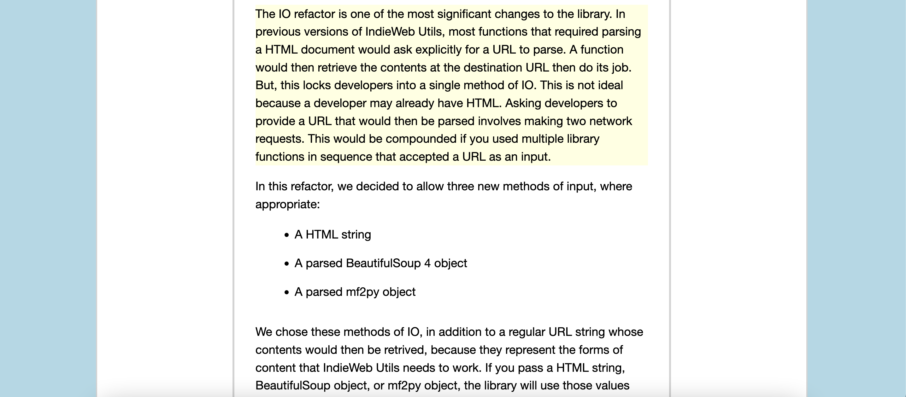

# fragmention.js

An implementation of the [Fragmention specification](https://indieweb.org/fragmention) in JavaScript.

## Getting Started

The `fragmention.js` script lets you link to specific pieces of text in `
` tags on a web page using the fragmention syntax. Consider the following URL:

    https://jamesg.blog/2022/10/10/announcing-indieweb-utils-v0-3-1/#may+already+have+HTML

The text after the `#` is a fragmention. This part of the URL refers to a specific place on a page where a user should be taken.

The `fragmention.js` script searches every `
` tag until it finds a match for the string in the fragmention. In a fragmention, spaces are represented as plus signs (`+`). This fragmention implementation is case sensitive.

When a match is found, a user is scrolled to that part of the document. A class called `highlight` is applied to the text tag so you can add styles as you want.

To use this script, first download `fragmention.js`. Then, add a link to your version of the script before the closing `</body>` tag on the page:

    

## Example

The aforementioned URL navigates a user to the paragraph that contains the string "may already have HTML". This section is highlighted in yellow by the web page:

## Contributing

If you have a suggestion on how to improve this script, please feel free to file an issue so improvements can be discussed before being turned into Pull Requests.

## License

This code is released into the public domain.

## Contributors

- capjamesg
